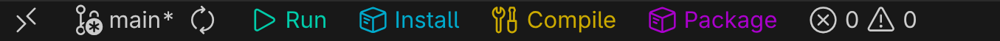

# Project Actions

Add custom action buttons to your VS Code status bar that execute shell commands with a single click.



## Contents

- [Quick Start](#quick-start)
- [Configuration](#configuration)
- [Variables](#variables)
- [Global Actions](#global-actions)
- [Settings](#settings)

## Quick Start

1. Open Command Palette (`Ctrl+Shift+P` or `Cmd+Shift+P`)
2. Run **"Project Actions: Edit Project Actions"**
3. Configure your actions in the generated [`.project-actions.json`](.project-actions.json) file

**Example configuration:**

```json
{
  "actions": [
    {
      "text": "$(play) Run",
      "command": "npm start",
      "tooltip": "Start development server"
    },
    {
      "text": "$(beaker) Test",
      "command": "npm test",
      "tooltip": "Run tests"
    }
  ]
}
```

Buttons appear automatically on the status bar and update on file save.

## Configuration

Each action requires:

- **`text`**: Button label (supports [Codicons](https://microsoft.github.io/vscode-codicons/dist/codicon.html) like `$(play)`)
- **`command`**: Shell command to execute
- **`tooltip`** *(optional)*: Hover text
- **`color`** *(optional)*: Text color (CSS format)

## Variables

Use VS Code variables for dynamic commands:

- `${file}` - Current file path
- `${fileBasename}` - Current filename
- `${fileDirname}` - Current file's directory
- `${workspaceFolder}` - Workspace root path
- `${relativeFile}` - File path relative to workspace

**Example:**

```json
{
  "text": "$(play) Run File",
  "command": "python ${file}",
  "tooltip": "Run current Python file"
}
```

[See all variables](https://code.visualstudio.com/docs/editor/variables-reference)

## Global Actions

Define actions in VS Code settings that appear based on file patterns:

1. Open Command Palette (`Ctrl+Shift+P` or `Cmd+Shift+P`)
2. Run **"Project Actions: Edit Global Actions"**
3. Add global actions as follows:

```json
{
  "project-actions.globalActions": [
    {
      "text": "$(repo-pull) Pull",
      "command": "git pull",
      "glob": "**/.git",
      "tooltip": "Pull latest changes"
    }
  ]
}
```

Global actions appear when the `glob` pattern matches files in your workspace (e.g., `**/.git` shows the action in Git repositories).

## Settings

- `project-actions.configFileName`: Config file name (default: `.project-actions.json`)
- `project-actions.globalActions`: Global actions with glob patterns

## License

MIT License - see [LICENSE](LICENSE) file for details

## Contributing

Contributions are welcome! Please feel free to submit a Pull Request to the [GitHub repository](https://github.com/julynx/vscode-project-actions).

## Issues

Found a bug or have a feature request? Please open an issue on the [GitHub issue tracker](https://github.com/julynx/vscode-project-actions/issues).
